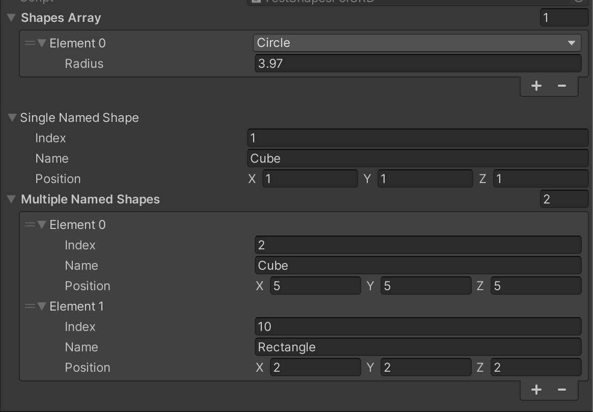

# LabelFromString Attribute

## (Unity) Editor Inspector Attribute for customize property labels

#### Attribute in action!


#### Without Attribute


### How to Use?
##### 1) Add attribute to property.
##### 2) Override ToString()!

### Installation:

1. Select in UPM "Add package from git URL..."
2. Install package with link.

```
https://github.com/AlexeyTaranov/LabelFromString.git
```

### LabelFromString Example:

```csharp
    [LabelFromString]
    public NamedShape SingleNamedShape;

    [Serializable]
    public class NamedShape
    {
        public int Index;
        public string Name;
        public Vector3 Position;

        public override string ToString()
        {
            return $"{Index} {Name}, Position - {Position}";
        }
    }
```
